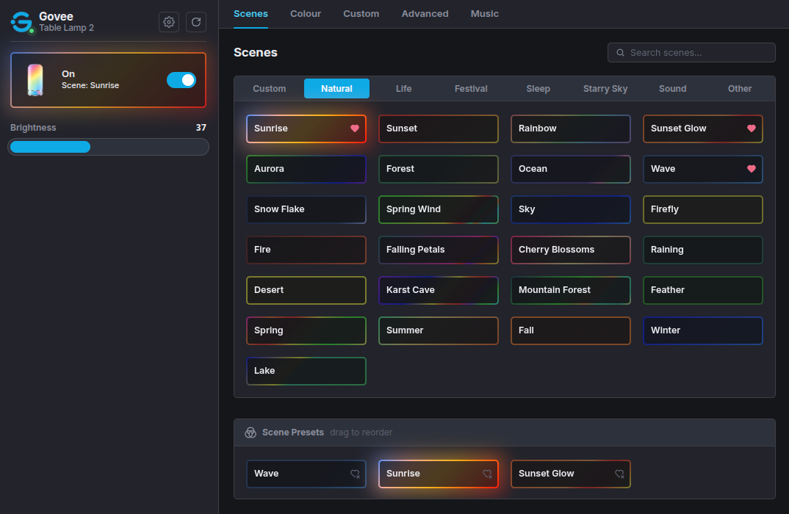
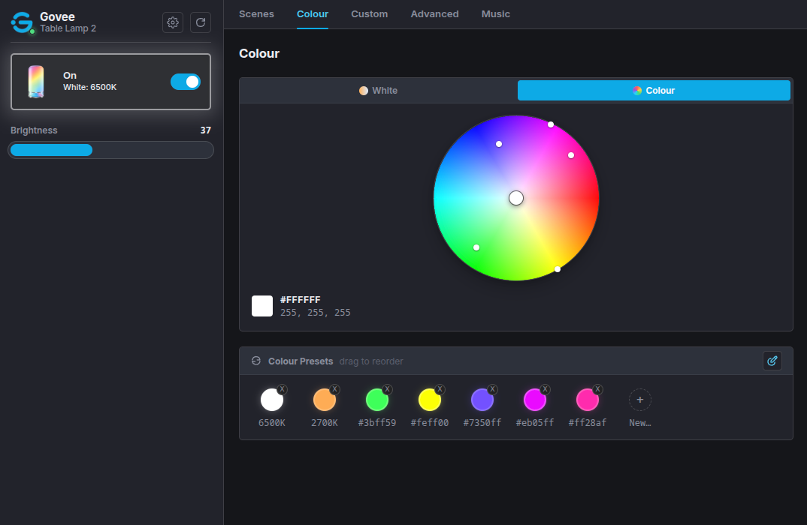
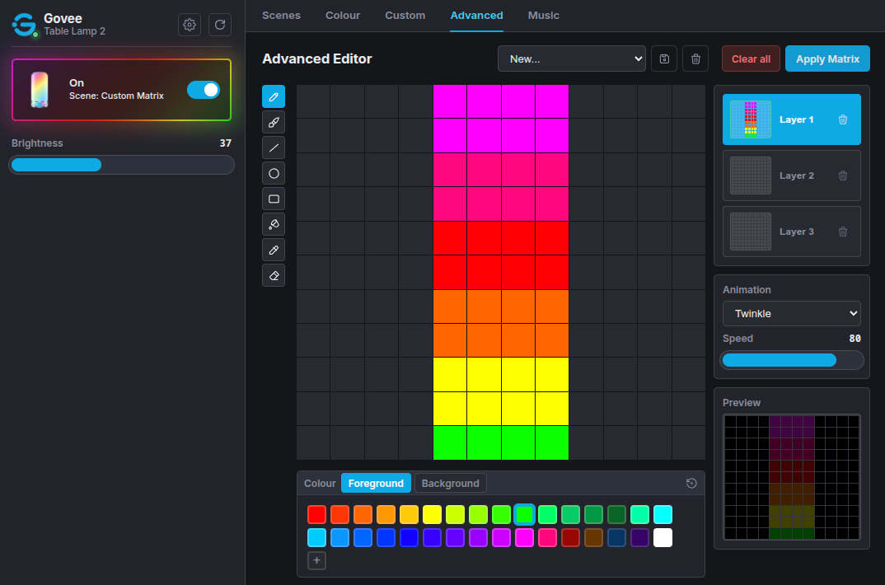

# Govee Smart Table Lamp 2 Bluetooth Dashboard

A lightweight dashboard for controlling a Govee Smart Table Lamp 2 (H6022) over Bluetooth Low Energy directly from the browser. This started as an experiment for basic lamp control over bluetooth, but it seems to have ended up pretty feature complete. The only thing missing is the carousel animation option.

[Open the hosted version here](https://dvdavd.github.io/govee-h6022-ble/)

## Features

- Connect to nearby Govee BLE H6022 lamps from the browser.
- Adjust power, brightness, colour temperature, and colour.
- Change scenes, customise palettes and edit animated multi-layer scenes
- Music effects with device microphone and browser microphone support
- Assign and rearrange scene and colour presets (on-device buttons)
- Configure wifi and bedtime switch settings
- Mobile friendly layout

## Screenshots

